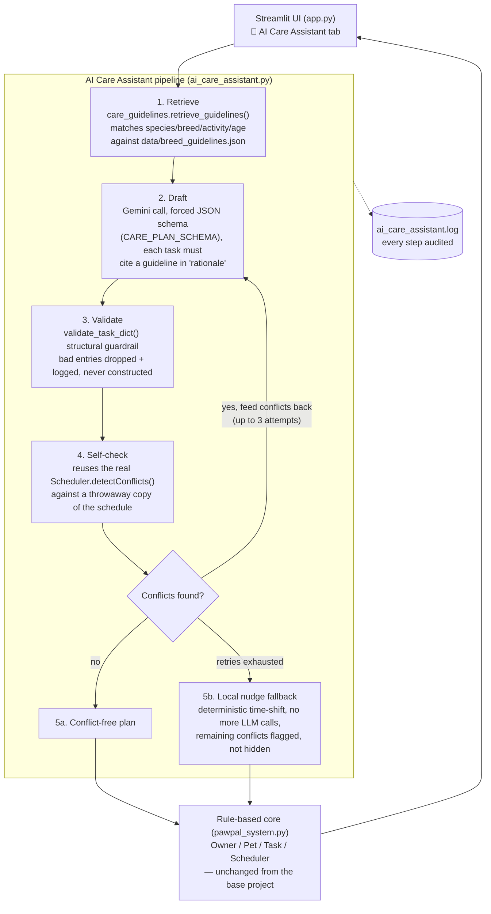

# PawPal+ AI Care Assistant

**Base project:** [PawPal+ (Module 2 Project)](../ai110-module2show-pawpal-starter) — a Streamlit app that helps a busy pet owner plan daily care tasks (walks, feeding, meds, grooming) across multiple pets. Its original scope was a rule-based scheduler: an `Owner`/`Pet`/`Task`/`Scheduler` class model that lets an owner add tasks with a time, priority, and recurrence, then generates a sorted daily schedule and flags scheduling conflicts (same pet double-booked, or multiple pets needed at once). No AI was involved — it was pure OOP design and scheduling logic.

This repository, takes that unmodified rule-based core and adds a genuine applied-AI feature on top of it: an **AI Care Assistant** that drafts a pet's care plan using retrieval-augmented generation and self-checks its own output before ever showing it to the user.

## Why this matters

Bolting an LLM onto an app is easy; making its output trustworthy is the actual engineering problem. It's simple to call an LLM and print whatever it says — it's harder to make sure what it says is *grounded* in real facts and doesn't *break* the app's existing rules. This project is my attempt at the second, harder thing:

- **Grounded, not hallucinated.** The assistant doesn't ask Gemini to "make up a care plan" — it first retrieves matching guidelines from a local knowledge base, hands only those to the model, and requires every proposed task to cite which guideline justified it.
- **Self-checking, not blind.** Instead of trusting the model's schedule, the app runs the AI's proposed tasks through the *same* conflict-detection logic the rule-based scheduler already uses — reusing proven code instead of asking the LLM to "just not double-book anything."
- **Fails safely.** If the model can't produce a clean plan after a bounded number of retries, the app falls back to a deterministic local fix and clearly flags whatever it couldn't resolve, rather than silently shipping a broken schedule or crashing.

This matters to me because it's the difference between "a chatbot feature" and an AI feature you could actually ship: one that's auditable, degrades gracefully, and never asks the user to blindly trust the model.

## Architecture Overview



**Two layers, cleanly separated:**
- `pawpal_system.py` is the **base project's** rule-based scheduling core (unchanged): plain-Python dataclasses for `Task`, `Pet`, `Owner`, and `Scheduler`, with no AI dependency at all.
- `care_guidelines.py` and `ai_care_assistant.py` are the **new applied-AI layer**. `care_guidelines.py` is pure retrieval (no network, no LLM) so it can be tested and verified in complete isolation. `ai_care_assistant.py` orchestrates the LLM call, then leans on the base project's own `Scheduler.detectConflicts()` for validation instead of re-implementing conflict logic — the AI layer is a thin, auditable addition on top of code that was already trusted.

If `GEMINI_API_KEY` isn't set, only the AI tab is affected — the rest of the app (scheduling, conflict detection, recurring tasks) works exactly as it did in the base project.

## Setup Instructions

```bash
# 1. Clone/enter the project and create a virtual environment
cd applied-ai-system-final
python -m venv .venv
source .venv/bin/activate        # Windows: .venv\Scripts\activate

# 2. Install dependencies
pip install -r requirements.txt

# 4. Run the app
streamlit run app.py

# 5. Run the tests
pytest              # full suite
pytest --cov        # with coverage
```

## Sample Interactions

The examples below walk through the actual retrieve → draft → validate → check pipeline in `ai_care_assistant.py`, using real entries from `data/breed_guidelines.json` and the same request/response shapes exercised by the mocked tests in `tests/test_ai_care_assistant.py`. They illustrate what the pipeline does at each step rather than a single copy-pasted terminal transcript.

**1. Max — Labrador Retriever, age 4, high activity level**

Retrieval matches breed- and activity-specific guidelines first:
```
Retrieved guidelines: [ex-high-working-01, health-labrador-01]
"High-energy working/sporting breeds need 60-90 total minutes of vigorous daily
exercise, ideally split into two sessions, to prevent weight gain..."
```
Gemini's structured response (validated, then turned into real `Task` objects):
```json
{"tasks": [
  {"description": "Morning run", "time": "06:30", "duration": 45,
   "frequency": "daily", "priority": "high",
   "rationale": "ex-high-working-01: high-activity working breed needs a vigorous session"},
  {"description": "Evening fetch session", "time": "17:30", "duration": 30,
   "frequency": "daily", "priority": "medium",
   "rationale": "ex-high-working-01: split into two sessions per guideline"}
]}
```
No conflicts against Max's existing schedule → returned to the UI on the first attempt (`iterations_used = 1`).

**2. Cooper — Beagle, age 6, medium activity level (conflict + retry)**

Cooper already has a 07:00 Breakfast task. Gemini's first draft proposes a 07:00 walk (a plausible time, but it collides):
```
Attempt 1: [CONFLICT] Cooper has multiple tasks at 07:00: "Breakfast" & "Midday walk"
```
The conflict is fed back into the next prompt verbatim ("adjust the times of your proposed tasks to resolve these conflicts"), and Gemini's second attempt moves the walk to 08:00 with the same guideline-grounded duration — `iterations_used = 2`, no conflicts remain.

**3. A cat profile — Domestic Shorthair, medium activity level**

Retrieval is species-filtered before it ever reaches the model: a dog-only guideline like `ex-high-working-01` is excluded, and only species-appropriate entries (e.g. `cat-enrichment-01`, the shared `feed-adult` guideline) are retrieved. This is enforced in `care_guidelines._matches()` and covered directly by `test_retrieve_guidelines_filters_by_species` — the LLM is never even given the option to suggest a dog-specific routine for a cat, because it's not in its context.

## Design Decisions

- **Schema-forced output + a required `rationale` field.** Rather than parsing free-form prose, every Gemini call uses `response_schema=CARE_PLAN_SCHEMA` and requires each task to name the guideline that justified it. Trade-off: this constrains the model's creativity (it can't propose something outside the retrieved guidelines' scope), but that's the point — it's a guardrail against confidently-invented breed facts, not a feature limitation.
- **Two independent guardrail layers.** Layer 1 is structural (`validate_task_dict()` — right types, right ranges, right enums) and layer 2 is behavioral (reusing `Scheduler.detectConflicts()`, the base project's own tested conflict logic). Reusing the existing scheduler code instead of writing new "AI-aware" conflict detection means the AI's output is held to the exact same bar as a human-entered task.
- **Bounded retries, then a deterministic fallback — never a crash or an infinite loop.** Up to 3 Gemini calls are allowed per plan (cost/latency trade-off), and if conflicts persist, one local, non-LLM "nudge" pass pushes times forward until they clear. This guarantees the feature always returns *something* usable in bounded time, at the cost of occasionally returning a plan whose times aren't the model's original (arguably more "natural") suggestion.
- **Flag, don't auto-resolve — inherited from the base project.** The base scheduler's original design choice was to warn about conflicts rather than silently reschedule them, because only the owner knows which task can actually move. The AI layer keeps that same philosophy: any conflict it can't clear is surfaced in the UI, never hidden or silently dropped.
- **A pure, LLM-free retrieval module.** `care_guidelines.py` has zero network or SDK dependency by design, so retrieval quality (ranking, species filtering, fallback-to-generic behavior) can be verified with fast, deterministic unit tests independent of any API availability or cost.

## Testing Summary

**What's covered:**
- The rule-based core (`test_pawpal.py`, `test_recurring_tasks.py`) — task lifecycle, recurring-task generation, conflict detection, filtering — carried over from the base project.
- Retrieval (`test_care_guidelines.py`) — knowledge-base shape validation, breed-specific entries ranking ahead of generic ones, graceful fallback for unknown breeds, and species filtering (a cat never receives a dog-only entry).
- The AI pipeline (`test_ai_care_assistant.py`) — the structural guardrail's accept/reject cases, that conflict-checking never mutates the real scheduler, and `generate_care_plan`'s success/retry/exhausted-retries/malformed-output/missing-API-key paths. The Gemini client is mocked throughout, so this entire suite runs free, deterministically, and without a live API key — a real engineering win for CI.

**What's not covered / what I'd add next:**
- No live-Gemini integration test — the mocked unit tests verify the pipeline's *logic*, but not that the real API's response shape still matches `CARE_PLAN_SCHEMA` if Google changes the model's behavior.
- Per my own project reflection, edge cases like midnight-boundary task times and daylight-saving-time shifts in recurring task generation aren't tested yet — the fixed-interval math (`+1 day`, `+30 days` for "monthly") doesn't handle those correctly.
- What I learned: mocking the LLM boundary was the single highest-value testing decision in this project — it let me test retry/conflict/failure logic exhaustively without spending API quota or dealing with model non-determinism, which is a pattern I'd reach for immediately on any future LLM-backed feature.

## Reflection

Building the guardrail layers taught me that the hard part of "adding AI" to an app isn't the API call — it's deciding what happens when the model is wrong, slow, or returns something malformed, and building the tests that prove those paths actually work. Reusing the base project's existing, already-tested conflict-detection logic instead of asking the LLM to reason about scheduling itself was the single decision that made this feature trustworthy rather than just impressive-looking.

*The graded responsible-AI reflection — how I collaborated with AI tools while building this, one AI suggestion that helped and one that was flawed, and this system's limitations — lives in `model_card.md`, not here.*
